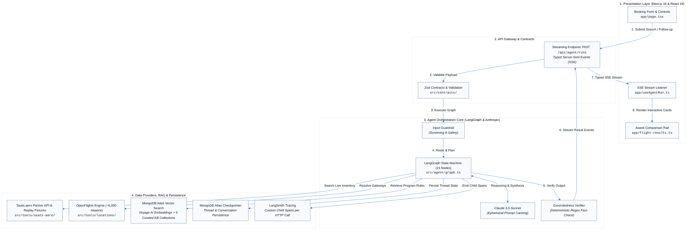
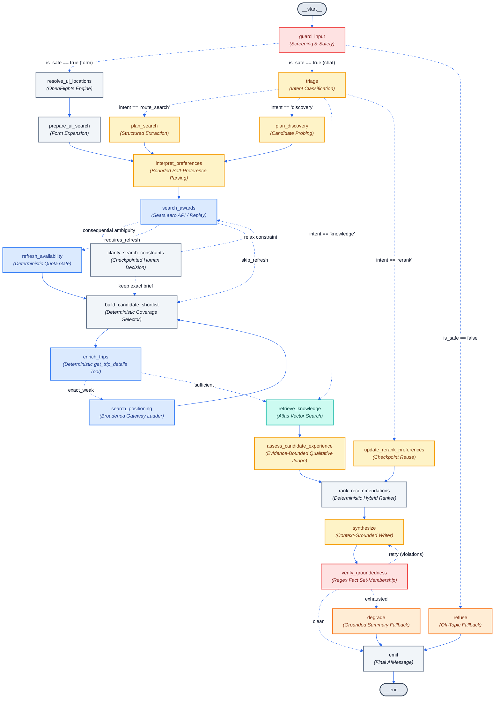
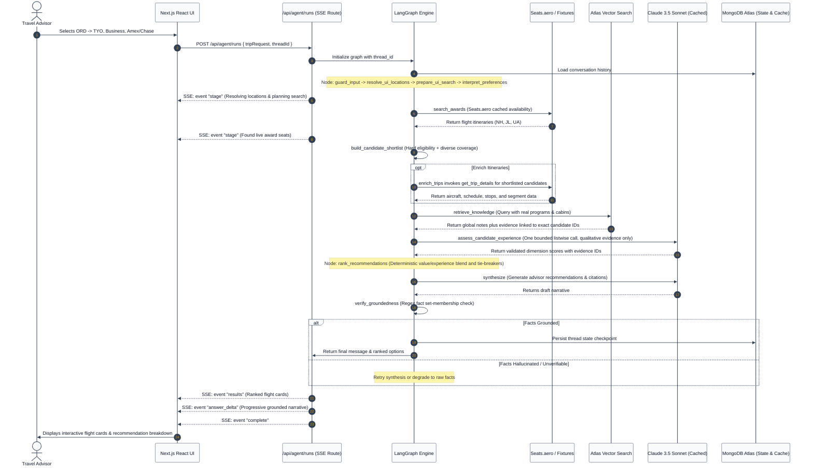

# System Architecture

Roam is an agentic award-flight research platform engineered with a strict **deterministic-gate / agentic-reasoning** architecture. It pairs real-time award inventory search with a domain-curated knowledge base, providing travel advisors with grounded recommendations, accurate mileage pricing, and verifiable transfer paths.

---

## 1. High-Level System Architecture

The application is organized into four clean, decoupled tiers:

---

## 2. LangGraph Execution & State Machine

The orchestration graph contains **15 specialized nodes** designed to separate deterministic operations from bounded LLM reasoning.

---

## 3. Technology Stack Matrix

| Category | Technology | Purpose & Implementation | Key Files |
|---|---|---|---|
| **Framework & Fullstack** | **Next.js 16.3.0** (Turbopack) | App Router, Server Components, TypeScript compilation, API routes | `app/`, `next.config.ts` |
| **Frontend Runtime** | **React 19.2.8** | State hooks, responsive CSS modules, dynamic comparison rail, SSE event listener | `app/page.tsx`, `app/useAgentRun.ts` |
| **Styling & Typography** | **CSS Modules + Fontsource** | Bespoke dark/light themes, Manrope (sans) and Newsreader (editorial serif) | `app/page.module.css`, `app/globals.css` |
| **Icons & Visuals** | **Phosphor Icons React** | Accessible, consistent iconography for cabins, airlines, transfers, and controls | `app/AirlineLogo.tsx`, `app/page.tsx` |
| **Agent State Machine** | **@langchain/langgraph 1.4.9** | 22-node cyclic execution graph with conditional branching, checkpointed human interrupts, checkpoint reuse, and grounded retries | `src/agent/graph.ts`, `src/agent/state.ts` |
| **LLM Orchestration** | **@langchain/anthropic 1.5.4** | Claude 3.5 Sonnet integration with ephemeral prompt caching (`cache_control`) | `src/agent/models.ts`, `src/agent/cache.ts` |
| **Vector Search & DB** | **MongoDB Atlas & MongoDB Node SDK 6.21** | Vector search index for knowledge retrieval & conversation checkpointer (`MongoDBSaver`) | `src/rag/store.ts`, `src/rag/retriever.ts` |
| **Vector Embeddings** | **Voyage AI (`voyage-3-lite`)** | High-dimensional dense embeddings for award rules, reviews, and transfer policies | `src/rag/store.ts`, `src/rag/ingest.ts` |
| **Award Data Engine** | **Seats.aero Partner API** | Real-time availability, cached searches, route-ladder positioning, and replay fixtures | `src/tools/seats-aero/`, `fixtures/seats-aero/` |
| **Location Intelligence** | **OpenFlights Dataset (~6k airports)** | Deterministic IATA, metro-area, regional, and geo-coordinate resolution | `src/tools/locations/`, `scripts/ingest-airports.ts` |
| **Type Validation** | **Zod 4.4.3** | Strict schema validation for API payloads, tool arguments, frontmatter, and graph state | `src/contracts/`, `src/rag/frontmatter.ts` |
| **Observability & Tracing**| **LangSmith 0.8.10** | Graph tracing, external API child spans, preference feedback, failure annotation queues, and reviewed-run dataset promotion | `src/tools/seats-aero/traced.ts`, `src/observability/user-feedback.ts` |
| **Testing & Evals** | **Vitest 4.1.10 + LangSmith Evals** | 3-tier eval suite (Intent routing, Search planning F1, Groundedness judge) | `evals/`, `src/**/*.test.ts` |

---

## 4. Key Architectural Patterns & Guarantees

### 1. The Deterministic Search vs. Conversational Dual-Path
- **Structured Search Form**: Bypasses conversational parsing. User inputs (airports, dates, cabins, transfer programs) are directly mapped into `AgentState` via `resolve_ui_locations` and `prepare_ui_search`. An LLM is never asked to guess IATA codes or dates.
- **Conversational Follow-up**: Handled via `triage` which routes either to structured extraction (`plan_search`), exploratory candidate generation under a strict budget (`plan_discovery`), or pure informational knowledge retrieval (`retrieve_knowledge`).
- **Bounded Preference Interpretation**: `interpret_preferences` uses Haiku structured output only for soft language, merges it with explicit slider/chip inputs under code-owned bounds, and falls back to deterministic keywords. Hard search fields are absent from its schema.
- **Coverage Before Costly Enrichment**: `build_candidate_shortlist` applies hard eligibility and round-robin coverage quotas before any trip-detail calls, preventing a mileage-ordered provider response from excluding promising nonstop, preferred-carrier, program, date, or positioning alternatives.

### 2. Post-Search Grounded RAG
Rather than guessing knowledge queries before award space is found:
1. Seats.aero returns raw available flights.
2. The query and structural metadata filters (e.g. `programs: ["aeroplan", "lifemiles"]`, `targetCabin: "business"`) are dynamically constructed from the **actual returned inventory**.
3. Vector search executes against the 5 curated markdown collections (`knowledge/sweet-spots`, `knowledge/transfers`, `knowledge/products`, `knowledge/booking`, `knowledge/seasonality`).

### 3. Dual-Stage Safety & Zero-Hallucination Loop
- **Input Screening**: The `guard_input` node screens against prompt injection, malicious instructions, and off-topic questions.
- **Output Fact Verification**: The `verify_groundedness` node parses all mileage figures, airline codes, taxes/fees, and flight numbers from the synthesized draft using regex and strictly verifies their existence in the graph tool state.
- **Self-Correction & Fallback**: If an ungrounded claim is detected, the graph triggers a single self-correction revision. If it fails a second time, it automatically falls back to `degrade`, outputting a deterministic, factual list directly from raw tool state.

### 4. Cost Engineering & Prompt Caching
- **Ephemeral Prompt Caching**: System prompts over 1,024 tokens (the search planner and synthesizer) leverage Anthropic's `cache_control: { type: "ephemeral" }`.
- **Dynamic Clock Isolation**: Ephemeral time/date data is injected solely into user turns, ensuring system prompt prefixes remain byte-identical across runs for maximum cache-hit rates.
- **Quota Protection**: Expensive external API calls (e.g., live Seats.aero `/refresh`) are deterministic graph nodes with strict rate limits, rather than open tools given to the model. `get_trip_details` is a typed LangChain tool invoked by deterministic `enrich_trips` code across a capped candidate pool.

---

## 5. End-to-End Search & Chat Request Lifecycle

