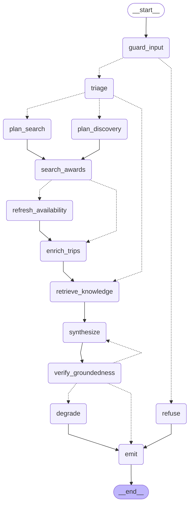

# Award Travel Concierge

An agent that helps someone evaluate airline miles/points redemptions. It searches real-time award availability via the [seats.aero](https://seats.aero) Partner API, cross-references a curated knowledge base of program rules and cabin-product reviews, and produces a grounded, cited answer — never inventing a flight number, mileage figure, or airline it can't point back to a real tool result.

Three kinds of questions, three different paths through the same graph:

- **"Business class ORD to Tokyo in October"** → structured search: extract origin/destination/cabin/dates, hit the API directly.
- **"Where should I go from Chicago this summer?"** → open-ended discovery: enumerate candidate program×region×cabin probes under a hard budget, since there's no single query to run.
- **"Does Chase transfer to Alaska?"** → pure knowledge question: skip search entirely, answer from the knowledge base.

## Requirements checklist

**Must-haves**

| Requirement | Where |
|---|---|
| LangGraph for state and control flow | 13-node graph, `Annotation.Root` state, conditional routing on intent/violations/staleness — [`src/agent/graph.ts`](src/agent/graph.ts), [`src/agent/state.ts`](src/agent/state.ts) |
| LangChain for model calls, tools, RAG | `ChatAnthropic` throughout, one genuinely bound tool, `MongoDBAtlasVectorSearch` for RAG |
| LangSmith tracing | Automatic per-node graph tracing (real API key required) plus a manual wrapper adding a child span per seats.aero HTTP call — [`src/tools/seats-aero/traced.ts`](src/tools/seats-aero/traced.ts) |
| Solves a problem end to end | Real seats.aero data + a real 35-document knowledge base; runs live by default, falls back to recorded fixtures with no seats.aero key at all |
| At least one tool | `get_trip_details`, bound via `.bindTools()` inside `enrich_trips` — see [Design notes](#design-notes) for why this is the *only* bound tool |
| RAG against a mini knowledge base | 35 hand-authored documents (sweet spots, transfer partners, booking rules, seasonality, cabin reviews), metadata-prefiltered vector search — [`knowledge/`](knowledge/), [`src/rag/`](src/rag/) |
| Eval with expected outcomes | **Not yet implemented** — see [Evals](#evals) |

**Nice-to-haves**

| | |
|---|---|
| Guardrails | An input-screening node rejects off-topic/injection-shaped messages before anything else runs; a deterministic groundedness verifier checks every claim in the draft against real tool output and retries or degrades rather than shipping an unsupported answer |
| Streaming output | The chat API streams newline-delimited JSON — a status event per graph node ("Searching 5 programs from ORD/MDW…"), then the answer, then cost/option data |
| Docker / Makefile | `docker-compose.yml` (MongoDB Atlas Local) + `Makefile` (`setup`, `seed`, `dev`, `record`, `eval`, `test`) |

## Quickstart

```bash
cp .env.example .env    # add ANTHROPIC_API_KEY, VOYAGE_API_KEY, LANGSMITH_API_KEY
make setup               # installs deps, starts MongoDB Atlas Local
make seed                # embeds the knowledge base
make dev                 # http://localhost:3000
```

`SEATS_AERO_API_KEY` is optional. Without it, the app runs entirely against recorded fixtures in `fixtures/seats-aero/` — useful for a reproducible demo that doesn't depend on live award-space inventory or burn API quota.

## Graph

Generated directly from the compiled graph (`buildGraphWithoutCheckpointer().getGraph().drawMermaid()`), so it can't drift from the code — see [`docs/graph.md`](docs/graph.md) to regenerate it.



Solid edges are unconditional; dashed edges are routing decisions. `guard_input` screens every message first; a rejection short-circuits straight to `emit`. `triage` classifies intent and picks one of two planners (or skips both for a pure knowledge question). Every path converges on `enrich_trips → retrieve_knowledge → synthesize`, then a deterministic groundedness check that either emits, retries synthesis once, or degrades to a raw-data fallback.

## Design notes

**Retrieval runs *after* search, not before.** The RAG query and its metadata pre-filter are both built from the airlines and programs that actually came back from seats.aero — not guessed ahead of time from the user's question alone. "Is 87,500 miles a good price?" retrieves poorly on its own; the same question alongside "aeroplan business NH ORD-NRT 87500 miles" retrieves the right documents. Aircraft type is folded into the embedded query text but deliberately *not* into the structural filter — only one of the five knowledge-base collections (`products`, the cabin reviews) ever tags an aircraft, and a hard filter would silently exclude the other four whenever a trip has aircraft data, which is nearly always once enrichment has run.

**Two planners, because the two problems have different shapes.** A precise request ("business class ORD to Tokyo") is structured extraction — pull origin, destination, cabin, and dates out of one sentence. An open-ended request ("where should I go this summer?") is candidate generation under a budget — there's no single search to run, so the model proposes a shortlist of program×region×cabin probes and the graph caps that list in code (`DISCOVERY_BUDGET`), because a prompt saying "pick at most 6" is a suggestion and `slice(0, 6)` is a guarantee.

**Location resolution never asks a model for an IATA code.** `resolveLocation` is a deterministic lookup against a ~6,000-airport table generated from OpenFlights — an LLM asked to emit an airport code will confidently invent one, and a hallucinated code becomes a silent empty search rather than a visible error. When a query is genuinely ambiguous ("San" matches San Francisco, San Diego, San Jose, and others), the resolver returns the honest list of candidates instead of guessing one, and the synthesis step surfaces that to the user rather than quietly searching nothing.

**Refresh is a graph node, not a tool.** Re-confirming availability with seats.aero's `/refresh` endpoint spends real, finite daily quota. If the model held it as a tool, nothing would stop it from calling that as often as it liked. Instead the graph decides when refresh is worth it — a precise query, a small result set, data old enough to matter — and the model never sees the decision at all.

**Groundedness is checked deterministically, not by an LLM judge.** After synthesis, every mileage figure, flight number, and airline code in the draft is extracted with a regex and checked for set membership against the actual tool results already in state. "Did the model invent a flight number" is a lookup, not a judgment call — and a lookup can't itself hallucinate a verdict the way a second model call could. One violation triggers exactly one retry; if the retry is still ungrounded, the graph degrades to a plain listing of the real data rather than looping or shipping an unverified claim.

**Exactly one tool is genuinely bound to the model, and it's a deliberate exception to everything above.** `get_trip_details`, called from inside `enrich_trips`, is the only operation the model can invoke on its own. Every other seats.aero call — search, regional availability, refresh — is made directly by deterministic node code, because their call counts need a hard cap enforced in code against a 1,000-call/day budget; a model holding a bound search tool could call it without limit. `get_trip_details` is safe to delegate specifically because by the time it's offered, the candidate list is already capped at 5 by code upstream — the worst case if the model over-calls is a handful of wasted lookups, not a runaway bill. That bounded-blast-radius property is what makes a decision worth handing to the model instead of hard-coding it.

**Cost engineering, because this runs on a personal budget.** Sonnet 5's prompt caching is applied to the two system prompts long enough to clear the 1024-token minimum (the search planner and the synthesizer — Anthropic silently no-ops `cache_control` below that threshold, so `cachedSystem()` throws rather than pretending it worked). Each node calls the model at a different effort tier — low for classification, medium for the answer that actually matters. A MongoDB-backed response cache sits in front of seats.aero's own data. The detail that actually determines whether caching pays off: today's date never enters a cached system prompt — it goes in the volatile user turn instead, the same place conversation history does, because baking a value that changes daily into a prefix meant to stay stable defeats the entire point of caching it. A cost HUD (dev-only) makes cache hit rate and per-node spend visible while iterating, specifically because a stuck-at-0% hit rate is otherwise invisible until the bill arrives.

## Evals

Planned as three datasets, deliberately layered by cost — **not yet implemented in this snapshot**:

1. **Intent routing** — exact string match against expected `route_search`/`discovery`/`knowledge` labels. No model involved; runs in seconds, cheap enough to re-run on every prompt edit.
2. **Search planning** — field-level partial credit, because a plan that finds the right origin but misses one destination airport is mostly right, not simply wrong.
3. **End-to-end groundedness** — an LLM judge scores helpfulness (where judgment is genuinely required), but the hallucination check itself reuses the same deterministic set-membership logic as the live groundedness node, because that check shouldn't become less trustworthy just because it's being run offline.

## What I'd improve with more time

- **Token-level streaming from `synthesize`.** The draft currently arrives as one block once the model finishes; the status trail covers perceived latency in the meantime, but real token streaming would be a straightforward follow-up (`streamMode: "messages"` filtered to the synthesize node).
- **A native route-arc map** instead of the AeroConnections deep-link handoff — full styling control, no cross-origin dependency on a sibling project.
- **A larger knowledge base, and a real freshness process for it.** The 35 documents carry an `updated` date, but nothing currently re-verifies a product review or sweet-spot claim against reality over time.
- **Live Search integration**, which needs a commercial seats.aero agreement beyond the Partner API's cached search and bulk availability endpoints used here.
- **Multi-turn eval coverage** — the planned datasets are all single-turn; the multi-turn state-leak class of bug (stale search results bleeding into an unrelated follow-up question) was one of the more serious issues caught during development, and there's no automated regression coverage for it yet beyond manual verification.
- **Distinguish a failed search from a genuinely empty one.** Both currently read to the user as "no availability was returned," which is honest but conflates a real API error with a real empty result — needs a small explicit state signal rather than inferring it from an empty array.
- **A real per-trip carrier field.** Enrichment's trip-detail lines currently render an empty `carriers=` on every line in live testing; worth properly diagnosing whether that's a seats.aero data gap or a mapping bug rather than patching around it.

## Project layout

```
src/
├─ cost/          # token pricing math + per-node usage tracking
├─ tools/
│  ├─ seats-aero/ # live/replay API client, response cache, LangSmith tracing wrapper
│  ├─ locations/  # deterministic airport/region resolver (OpenFlights-backed)
│  ├─ search-awards.ts, trip-details.ts  # normalization + the one bound tool
├─ rag/           # frontmatter schema, Atlas ingest, metadata-prefiltered retriever
├─ agent/
│  ├─ state.ts, models.ts, cache.ts      # graph state, model factory, prompt caching
│  ├─ prompts/, nodes/                   # one file per node prompt / node
│  ├─ routers.ts, graph.ts               # conditional edges + the compiled graph
├─ deeplink.ts    # AeroConnections URL builder
app/
├─ api/chat/route.ts   # streaming chat endpoint
└─ components/         # chat UI, status trail, option cards, cost HUD
knowledge/         # 5 markdown collections — the RAG corpus
fixtures/seats-aero/  # recorded API responses for key-free demo/dev
scripts/            # airport dataset ingest, fixture recording
evals/               # (planned, not yet built)
```
