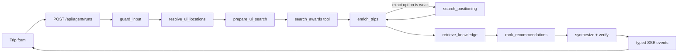

# Roam — award travel, handled

Roam is an award-flight research agent built for a travel advisor's workflow: set the trip constraints in a booking-style form, then inspect a ranked rail of verified award options. Chat is available for follow-ups, but it does not replace the search controls.

It searches real-time award availability via the [seats.aero](https://seats.aero) Partner API, cross-references a curated knowledge base of program rules and cabin-product reviews, and produces a grounded, cited answer — never inventing a flight number, mileage figure, or airline it can't point back to a real tool result.

## Quickstart

```bash
cp .env.example .env    # add ANTHROPIC_API_KEY, VOYAGE_API_KEY, LANGSMITH_API_KEY
make setup               # installs deps, starts MongoDB Atlas Local
make seed                # embeds the knowledge base
make dev                 # http://localhost:3000
```

`SEATS_AERO_API_KEY` enables live availability; without it, the Seats.aero client uses checked-in replay fixtures in `fixtures/seats-aero/` — useful for a reproducible demo that doesn't depend on live award-space inventory or burn API quota. `ANTHROPIC_API_KEY` enables model-based guardrails, tool selection, and explanation; structured form searches still run deterministically and return a grounded fallback narrative when that key is absent. `MONGODB_URI` is optional for local demo use; when unavailable, the runtime falls back to an in-memory graph without persistent thread history.

## Requirements checklist

**Must-haves**

| Requirement | Where |
|---|---|
| LangGraph for state and control flow | 15-node graph, `Annotation.Root` state, conditional routing on intent/violations/staleness — [`src/agent/graph.ts`](src/agent/graph.ts), [`src/agent/state.ts`](src/agent/state.ts) |
| LangChain for model calls, tools, RAG | `ChatAnthropic` throughout, one genuinely bound tool, `MongoDBAtlasVectorSearch` for RAG |
| LangSmith tracing | Automatic per-node graph tracing (real API key required) plus a manual wrapper adding a child span per seats.aero HTTP call — [`src/tools/seats-aero/traced.ts`](src/tools/seats-aero/traced.ts) |
| Solves a problem end to end | Real seats.aero data + a real knowledge base; runs live by default, falls back to recorded fixtures with no seats.aero key at all |
| At least one tool | `get_trip_details`, bound via `.bindTools()` inside `enrich_trips` — see [Design notes](#design-notes) for why this is the *only* bound tool |
| RAG against a mini knowledge base | Hand-authored documents (sweet spots, transfer partners, booking rules, seasonality, cabin reviews), metadata-prefiltered vector search — [`knowledge/`](knowledge/), [`src/rag/`](src/rag/) |
| Eval with expected outcomes | Three LangSmith-backed datasets with three different evaluator types — see [Evals](#evals) |

**Nice-to-haves**

| | |
|---|---|
| Guardrails | An input-screening node rejects off-topic/injection-shaped messages before anything else runs; a deterministic groundedness verifier checks every claim in the draft against real tool output and retries or degrades rather than shipping an unsupported answer |
| Streaming output | The API streams typed SSE events — a status event per graph node, then result data, then the answer |
| Docker / Makefile | `docker-compose.yml` (MongoDB Atlas Local) + `Makefile` (`setup`, `seed`, `dev`, `record`, `eval`, `test`) |

## What happens on a search

Generated directly from the compiled graph (`buildGraphWithoutCheckpointer().getGraph().drawMermaid()`), so it can't drift from the code — see [`docs/graph.md`](docs/graph.md) to regenerate it.



The form is validated with a shared Zod contract and is converted directly into graph state—Roam never asks an LLM to re-parse airports, dates, cabins, or transfer programs the advisor already selected. Free-form places such as Sorrento are resolved to suitable commercial gateways (NAP in that example), and every inferred IATA code is checked against the local airport dataset before search. Credit-card selections expand to their supported airline programs, and the selected airline programs are mapped to Seats.aero sources.

A follow-up chat message instead goes through the conversational planner: `triage` classifies intent and picks one of two planners — structured extraction (`plan_search`) for a precise request like "business class ORD to Tokyo," or candidate generation under a budget (`plan_discovery`) for an open-ended one like "where should I go this summer?" — or skips both straight to `retrieve_knowledge` for a pure knowledge question like "does Chase transfer to Alaska?"

The ranking node is deliberately deterministic and inspectable. It accounts for points cost, stop preference, the actual number of stops, known total layover time, preferred airlines, and known seats relative to traveler count. The best option appears first; every other valid option remains in the horizontal comparison rail. Facts on cards come from provider output or enrichment, while the narrative is grounded against graph state.

Because Seats.aero indexes route pairs rather than arbitrary connecting itineraries, Roam uses a bounded positioning ladder when the exact route has no strong option. For example, ORD→FUK broadens to ORD→TYO/JPN, then USA→JPN, and finally USA→ASA. The quality gate considers points, fees, duration, stops, and known seat count. A run can spend at most four Seats.aero route-search calls, and every broadened result is labeled with the separate positioning segment(s) it requires.

## Design notes

**Retrieval runs *after* search, not before.** The RAG query and its metadata pre-filter are both built from the airlines and programs that actually came back from seats.aero — not guessed ahead of time from the user's question alone. "Is 87,500 miles a good price?" retrieves poorly on its own; the same question alongside "aeroplan business NH ORD-NRT 87500 miles" retrieves the right documents. Aircraft type is folded into the embedded query text but deliberately *not* into the structural filter — only one of the five knowledge-base collections (`products`, the cabin reviews) ever tags an aircraft, and a hard filter would silently exclude the other four whenever a trip has aircraft data, which is nearly always once enrichment has run.

**Two planners, because the two problems have different shapes.** A precise request ("business class ORD to Tokyo") is structured extraction — pull origin, destination, cabin, and dates out of one sentence. An open-ended request ("where should I go this summer?") is candidate generation under a budget — there's no single search to run, so the model proposes a shortlist of program×region×cabin probes and the graph caps that list in code (`DISCOVERY_BUDGET`), because a prompt saying "pick at most 6" is a suggestion and `slice(0, 6)` is a guarantee.

**Location resolution never asks a model for an IATA code.** `resolveLocation` is a deterministic lookup against a ~6,000-airport table generated from OpenFlights — an LLM asked to emit an airport code will confidently invent one, and a hallucinated code becomes a silent empty search rather than a visible error. When a query is genuinely ambiguous ("San" matches San Francisco, San Diego, San Jose, and others), the resolver returns the honest list of candidates instead of guessing one, and the synthesis step surfaces that to the user rather than quietly searching nothing. The structured form path resolves free-form places (e.g. "Sorrento") to suitable commercial gateways the same way, before search ever runs.

**Refresh is a graph node, not a tool.** Re-confirming availability with seats.aero's `/refresh` endpoint spends real, finite daily quota. If the model held it as a tool, nothing would stop it from calling that as often as it liked. Instead the graph decides when refresh is worth it — a precise query, a small result set, data old enough to matter — and the model never sees the decision at all.

**Groundedness is checked deterministically, not by an LLM judge.** After synthesis, every mileage figure, flight number, and airline code in the draft is extracted with a regex and checked for set membership against the actual tool results already in state. "Did the model invent a flight number" is a lookup, not a judgment call — and a lookup can't itself hallucinate a verdict the way a second model call could. One violation triggers exactly one retry; if the retry is still ungrounded, the graph degrades to a plain listing of the real data rather than looping or shipping an unverified claim.

**Exactly one tool is genuinely bound to the model, and it's a deliberate exception to everything above.** `get_trip_details`, called from inside `enrich_trips`, is the only operation the model can invoke on its own. Every other seats.aero call — search, regional availability, refresh — is made directly by deterministic node code, because their call counts need a hard cap enforced in code against a daily quota; a model holding a bound search tool could call it without limit. `get_trip_details` is safe to delegate specifically because by the time it's offered, the candidate list is already capped by code upstream — the worst case if the model over-calls is a handful of wasted lookups, not a runaway bill. That bounded-blast-radius property is what makes a decision worth handing to the model instead of hard-coding it.

**Cost engineering, because this runs on a personal budget.** Sonnet 5's prompt caching is applied to the system prompts long enough to clear the 1024-token minimum (the search planner and the synthesizer — Anthropic silently no-ops `cache_control` below that threshold, so `cachedSystem()` throws rather than pretending it worked). Each node calls the model at a different effort tier — low for classification, medium for the answer that actually matters. A MongoDB-backed response cache sits in front of seats.aero's own data. The detail that actually determines whether caching pays off: today's date never enters a cached system prompt — it goes in the volatile user turn instead, the same place conversation history does, because baking a value that changes daily into a prefix meant to stay stable defeats the entire point of caching it.

## Optional follow-up chat

The small "Ask Roam a follow-up" control below the rail reuses the same LangGraph `thread_id`. A follow-up goes through the conversational planner; a new form submission uses the structured path and supersedes old search state. With Mongo configured, the thread persists across requests.

## Quality checks

```bash
npm run typecheck
ANTHROPIC_API_KEY=test npm test
npm run lint
npm run build
```

Tests cover graph traversal, structured-form planning, ranking, replayed Seats.aero data, retrieval, grounding, and model configuration. LangSmith tracing inherits the graph's model/tool runs; the API adds the UI version, request type, selected programs, and `roam-ui` tag to each request. `make eval` (or `npm run eval -- <intent|planning|grounded>`) runs the eval suite described below.

## Evals

Three datasets, deliberately layered by cost. Run them with `make eval` (all three) or `npm run eval -- <intent|planning|grounded>` individually — each seeds its LangSmith dataset on first run and reuses it thereafter, and results are viewable as real LangSmith experiments (traces, per-example scores, comparisons across runs).

1. **Intent routing** (`evals/datasets/intent-routing.jsonl`) — exact string match against expected `route_search`/`discovery`/`knowledge` labels. No model involved in scoring; runs in seconds, cheap enough to re-run on every prompt edit.
2. **Search planning** (`evals/datasets/search-planning.jsonl`, frozen reference clock) — field-level partial credit (`setF1` on airport sets, IoU on date windows), because a plan that finds the right origin but misses one destination airport is mostly right, not simply wrong. Results are routed through the real `searchPlan` merge reducer before scoring, matching what the production graph actually produces.
3. **End-to-end groundedness** (`evals/datasets/groundedness.jsonl`, forced replay mode) — an LLM judge scores helpfulness (where judgment is genuinely required: does it answer the question, name a program, give a booking path, cite the knowledge base), but the hallucination check reuses the exact same deterministic `findViolations` set-membership logic as the live groundedness node — that check doesn't become less trustworthy just because it's running offline.

Building this eval suite surfaced two genuine bugs unrelated to the evals themselves, both fixed in place: fixture recordings never included the `take`/`order_by` params the app always sends, so every replay-mode search was silently 404ing regardless of dataset quality; and a Voyage 429 rate-limit during knowledge retrieval was being treated identically to a genuine outage instead of retried, which briefly produced a worse-than-necessary degraded answer during the eval run itself.

## Tradeoffs and next steps

- Provider availability is volatile; Roam surfaces known seat counts but asks the advisor to confirm before a points transfer.
- The API streams stage and result events today; token-level answer deltas can be added when synthesis uses a streaming model invocation (`streamMode: "messages"` filtered to the synthesize node).
- Fixture replay makes local development deterministic, but only recorded request shapes have inventory. Record fresh fixtures with `npm run record` when adding demo scenarios — the recording script itself still needs the same `take`/`order_by` fix applied to the eval fixtures.
- **Discovery's origin handling.** Live testing surfaced a real, reproducible case — "From Chicago, where should I take a weekend trip during the summer using points?" — where the discovery planner missed an explicitly-named origin. A related but distinct angle on the same area: even when an origin *is* extracted, it can resolve to a seats.aero multi-city/metro code (e.g. "CHI" for Chicago) rather than a literal airport IATA code — worth verifying every downstream consumer of `searchPlan.origins` handles synthetic multi-city codes the same way it handles real airport codes.
- **A native route-arc map** instead of a deep-link handoff — full styling control, no cross-origin dependency.
- **A larger knowledge base, and a real freshness process for it.** The documents carry an `updated` date, but nothing currently re-verifies a product review or sweet-spot claim against reality over time.
- **Live Search integration**, which needs a commercial seats.aero agreement beyond the Partner API's cached search and bulk availability endpoints used here.
- **Multi-turn eval coverage.** All three eval datasets are single-turn; multi-turn conversation memory (`searchPlan`'s merge reducer) has hand-written regression tests built from real observed bug traces, but no dataset-driven eval coverage yet.
- The implementation plan and event contract live in [docs/ui-agent-integration-plan.md](docs/ui-agent-integration-plan.md).

## Project layout

```
src/
├─ cost/          # token pricing math + per-node usage tracking
├─ contracts/     # shared Zod contracts (trip request/response) between UI and API
├─ domain/        # award/credit-card program catalogs
├─ tools/
│  ├─ seats-aero/ # live/replay API client, response cache, LangSmith tracing wrapper
│  ├─ locations/  # deterministic airport/region resolver (OpenFlights-backed)
│  ├─ search-awards.ts, trip-details.ts  # normalization + the one bound tool
├─ rag/           # frontmatter schema, Atlas ingest, metadata-prefiltered retriever
├─ agent/
│  ├─ state.ts, models.ts, cache.ts, runtime.ts  # graph state, model factory, prompt caching, compiled-graph reuse
│  ├─ prompts/, nodes/                   # one file per node prompt / node
│  ├─ routers.ts, graph.ts               # conditional edges + the compiled graph
├─ deeplink.ts    # deep-link URL builder
app/
├─ api/agent/runs/route.ts, api/airports/route.ts  # streaming search endpoint + airport lookup
└─ page.tsx, page.module.css             # booking-style search form + research rail UI
knowledge/         # markdown collections — the RAG corpus
fixtures/seats-aero/  # recorded API responses for key-free demo/dev
scripts/            # airport dataset ingest, fixture recording
evals/               # datasets + evaluators for the LangSmith eval suite
```
