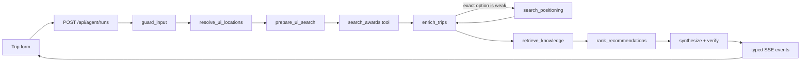

# Roam — award travel, handled

Roam is an award-flight research agent built for a travel advisor’s workflow: set the trip constraints in a booking-style form, then inspect a ranked rail of verified award options. Chat is available for follow-ups, but it does not replace the search controls.

## Quickstart

```bash
npm install
cp .env.example .env
npm run dev
```

Open `http://localhost:3000` (or the port printed by Next.js).

`SEATS_AERO_API_KEY` enables live availability. Without it, the Seats.aero client uses checked-in replay fixtures. `ANTHROPIC_API_KEY` enables model-based guardrails, tool selection, and explanation; structured form searches still run deterministically and return a grounded fallback narrative when that key is absent. `MONGODB_URI` is optional for local demo use; when unavailable, the runtime falls back to an in-memory graph without persistent thread history.

## What happens on a search



The form is validated with a shared Zod contract and is converted directly into graph state—Roam never asks an LLM to re-parse airports, dates, cabins, or transfer programs the advisor already selected. Free-form places such as Sorrento are resolved to suitable commercial gateways (NAP in that example), and every inferred IATA code is checked against the local airport dataset before search. Credit-card selections expand to their supported airline programs, and the selected airline programs are mapped to Seats.aero sources.

The ranking node is deliberately deterministic and inspectable. It accounts for points cost, stop preference, preferred airlines, and known seats relative to traveler count. The best option appears first; every other valid option remains in the horizontal comparison rail. Facts on cards come from provider output or enrichment, while the narrative is grounded against graph state.

Because Seats.aero indexes route pairs rather than arbitrary connecting itineraries, Roam uses a bounded positioning ladder when the exact route has no strong option. For example, ORD→FUK broadens to ORD→TYO/JPN, then USA→JPN, and finally USA→ASA. The quality gate considers points, fees, duration, stops, and known seat count. A run can spend at most four Seats.aero route-search calls, and every broadened result is labeled with the separate positioning segment(s) it requires.

## Optional follow-up chat

The small “Ask Roam a follow-up” control below the rail reuses the same LangGraph `thread_id`. A follow-up goes through the conversational planner; a new form submission uses the structured path and supersedes old search state. With Mongo configured, the thread persists across requests.

## Quality checks

```bash
npm run typecheck
ANTHROPIC_API_KEY=test npm test
npm run lint
npm run build
```

Tests cover graph traversal, structured-form planning, ranking, replayed Seats.aero data, retrieval, grounding, and model configuration. LangSmith tracing inherits the graph’s model/tool runs; the API adds the UI version, request type, selected programs, and `roam-ui` tag to each request.

## Tradeoffs and next steps

- Provider availability is volatile; Roam surfaces known seat counts but asks the advisor to confirm before a points transfer.
- The API streams stage and result events today; token-level answer deltas can be added when synthesis uses a streaming model invocation.
- Fixture replay makes local development deterministic, but only recorded request shapes have inventory. Record fresh fixtures with `npm run record` when adding demo scenarios.
- The implementation plan and event contract live in [docs/ui-agent-integration-plan.md](docs/ui-agent-integration-plan.md).
