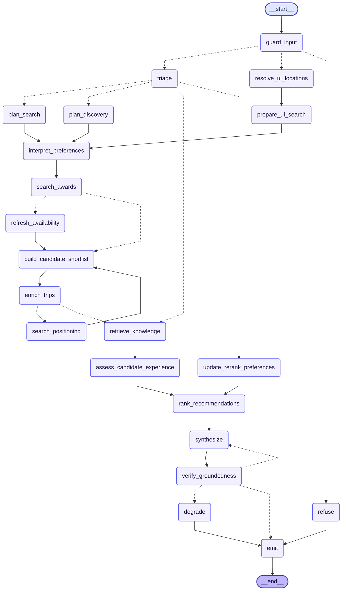

# Graph

Generated from the real compiled graph (`buildGraphWithoutCheckpointer().getGraph().drawMermaid()`)

```mermaid
%%{init: {'flowchart': {'curve': 'linear'}}}%%
graph TD;
	__start__([<p>__start__</p>]):::first
	guard_input(guard_input)
	refuse(refuse)
	triage(triage)
	resolve_ui_locations(resolve_ui_locations)
	prepare_ui_search(prepare_ui_search)
	plan_search(plan_search)
	plan_discovery(plan_discovery)
	search_awards(search_awards)
	search_positioning(search_positioning)
	interpret_preferences(interpret_preferences)
	build_candidate_shortlist(build_candidate_shortlist)
	enrich_trips(enrich_trips)
	retrieve_knowledge(retrieve_knowledge)
	assess_candidate_experience(assess_candidate_experience)
	update_rerank_preferences(update_rerank_preferences)
	rank_recommendations(rank_recommendations)
	synthesize(synthesize)
	refresh_availability(refresh_availability)
	verify_groundedness(verify_groundedness)
	degrade(degrade)
	emit(emit)
	__end__([<p>__end__</p>]):::last
	__start__ --> guard_input;
	assess_candidate_experience --> rank_recommendations;
	build_candidate_shortlist --> enrich_trips;
	degrade --> emit;
	emit --> __end__;
	interpret_preferences --> search_awards;
	plan_discovery --> interpret_preferences;
	plan_search --> interpret_preferences;
	prepare_ui_search --> interpret_preferences;
	rank_recommendations --> synthesize;
	refresh_availability --> build_candidate_shortlist;
	refuse --> emit;
	resolve_ui_locations --> prepare_ui_search;
	retrieve_knowledge --> assess_candidate_experience;
	search_positioning --> build_candidate_shortlist;
	synthesize --> verify_groundedness;
	update_rerank_preferences --> rank_recommendations;
	guard_input -.-> triage;
	guard_input -.-> resolve_ui_locations;
	guard_input -.-> refuse;
	triage -.-> plan_search;
	triage -.-> plan_discovery;
	triage -.-> retrieve_knowledge;
	triage -.-> update_rerank_preferences;
	search_awards -.-> refresh_availability;
	search_awards -.-> build_candidate_shortlist;
	enrich_trips -.-> search_positioning;
	enrich_trips -.-> retrieve_knowledge;
	verify_groundedness -.-> synthesize;
	verify_groundedness -.-> degrade;
	verify_groundedness -.-> emit;
	classDef default fill:#f2f0ff,stroke:#6366f1,color:#1e1b4b,stroke-width:1.5px,line-height:1.2;
	classDef first fill:#e0e7ff,stroke:#4338ca,color:#1e1b4b,stroke-width:2px;
	classDef last fill:#bfb6fc,stroke:#4338ca,color:#1e1b4b,stroke-width:2px;
```
