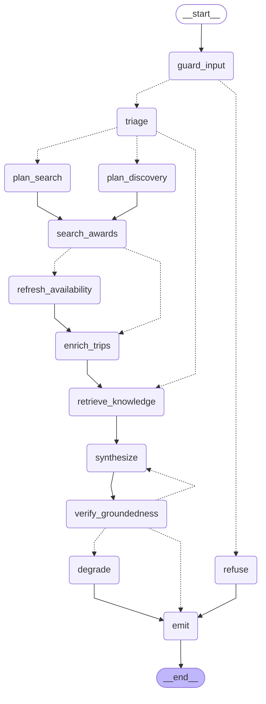

# Graph

Generated from the real compiled graph (`buildGraphWithoutCheckpointer().getGraph().drawMermaid()`) — this cannot drift from the code, because it is the code.

```mermaid
%%{init: {'flowchart': {'curve': 'linear'}}}%%
graph TD;
	__start__([<p>__start__</p>]):::first
	guard_input(guard_input)
	refuse(refuse)
	triage(triage)
	plan_search(plan_search)
	plan_discovery(plan_discovery)
	search_awards(search_awards)
	enrich_trips(enrich_trips)
	retrieve_knowledge(retrieve_knowledge)
	synthesize(synthesize)
	refresh_availability(refresh_availability)
	verify_groundedness(verify_groundedness)
	degrade(degrade)
	emit(emit)
	__end__([<p>__end__</p>]):::last
	__start__ --> guard_input;
	degrade --> emit;
	emit --> __end__;
	enrich_trips --> retrieve_knowledge;
	plan_discovery --> search_awards;
	plan_search --> search_awards;
	refresh_availability --> enrich_trips;
	refuse --> emit;
	retrieve_knowledge --> synthesize;
	synthesize --> verify_groundedness;
	guard_input -.-> triage;
	guard_input -.-> refuse;
	triage -.-> plan_search;
	triage -.-> plan_discovery;
	triage -.-> retrieve_knowledge;
	search_awards -.-> refresh_availability;
	search_awards -.-> enrich_trips;
	verify_groundedness -.-> synthesize;
	verify_groundedness -.-> degrade;
	verify_groundedness -.-> emit;
	classDef default fill:#f2f0ff,line-height:1.2;
	classDef first fill-opacity:0;
	classDef last fill:#bfb6fc;
```
