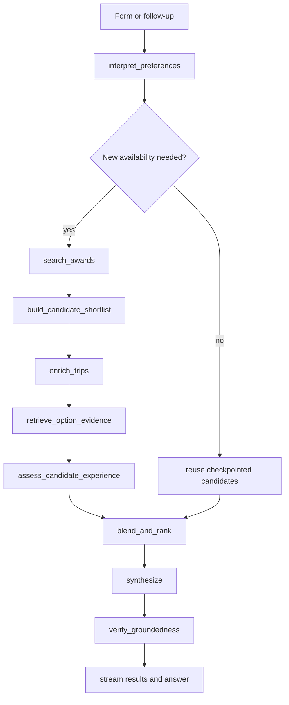

# Roam Preference-Aware Recommendation Engine Implementation Plan

**Goal:** Replace Roam's cost-dominated single utility function with an evidence-backed hybrid recommendation system that can trade points and fees against journey quality, rerank existing results across turns, explain the marginal tradeoff, and remain deterministic wherever facts or hard constraints are involved.

**Primary outcome:** For the same availability set, moving the ranking control from **Lowest points & fees** toward **Best overall journey** can change the leading option for an explicit, grounded reason such as a nonstop itinerary, shorter elapsed time, stronger cabin product, safer connection, or easier booking path.

**Architecture principle:** The LLM interprets language and evaluates qualitative evidence. Code enforces eligibility, calculates costs, normalizes scores, applies user weights, validates model output, and owns the final sort.

## Success criteria

- A five-position ranking control is part of the shared request contract and persists with the saved form.
- Hard constraints are never relaxed by the model or slider.
- A diverse, bounded candidate pool is enriched before recommendation, rather than enriching only the cheapest provider-ordered options.
- Every qualitative assessment names a real option id and references evidence supplied in its prompt.
- The application can fall back to the current deterministic ranker when the model or RAG is unavailable.
- A preference-only follow-up reranks checkpointed results without calling Seats.aero again.
- Cards explain the tradeoff against the cheapest viable option and expose category winners such as **Best value** and **Best experience**.
- LangSmith experiments measure preference alignment, hard-constraint compliance, grounding, stability, and reranking behavior.
- README and architecture claims match the code, especially around model-bound tools.

## Non-goals for the first release

- Letting the model invent or override mileage, fees, seat count, schedules, or availability.
- Giving the model unrestricted Seats.aero search or refresh tools.
- Treating an editorial product review as a guarantee that a specific aircraft configuration will operate.
- Building a universal airline-quality database before the core ranking path is evaluated.
- Allowing a slider change to trigger a new availability search.

## Target graph



The assessment node produces preference-independent dimension scores when possible. The rank node combines those scores with the current preference profile. This allows most later preference changes to reuse both provider results and model assessments.

## Proposed data model

### Request-level preference

Add an optional field to `TripRequest` with a default of `50` for backward compatibility:

```ts
type RankingPreference = {
  experienceWeight: number; // integer 0-100
  priorities: Array<
    | "cabin_product"
    | "schedule"
    | "few_connections"
    | "connection_quality"
    | "booking_ease"
    | "low_transfer_risk"
  >;
};
```

The slider controls `experienceWeight`. Priority chips and free-text notes refine dimension weights; they do not silently create hard constraints.

### Interpreted graph preference

Add a sticky `recommendationPreferences` state channel:

```ts
type RecommendationPreferences = {
  experienceWeight: number;
  dimensionWeights: {
    cabinProduct: number;
    schedule: number;
    itinerary: number;
    connectionQuality: number;
    bookingEase: number;
    transferRisk: number;
  };
  softPreferences: string[];
  explicitAvoidances: string[];
  rationale: string;
};
```

Only structured form fields remain hard constraints. The preference interpreter may translate notes into soft weights or explicit avoidances, but must not change airports, cabins, dates, balances, fee ceilings, traveler count, or a true nonstop requirement.

### Candidate assessment

Add a replace-on-write `candidateAssessments` state channel keyed by recommendation id:

```ts
type CandidateAssessment = {
  optionId: string;
  dimensions: {
    cabinProduct: number;       // 0-100
    schedule: number;
    itinerary: number;
    connectionQuality: number;
    bookingEase: number;
    transferRisk: number;
  };
  pros: string[];
  cons: string[];
  evidenceIds: string[];
  confidence: "high" | "medium" | "low";
};
```

Validate every option id and evidence id against the prompt payload. Reject unknown ids, clamp numeric fields, and fall back to deterministic dimension values for missing assessments.

### Recommendation output

Extend `FlightRecommendation` with:

- `valueScore`
- `experienceScore`
- `overallScore`
- `badges: ("best_overall" | "best_value" | "best_experience" | "best_schedule")[]`
- `tradeoff?: { comparedWithId: string; extraMiles: number; feeDifferenceUsd?: number; durationSavedMinutes?: number; stopsSaved?: number }`
- `assessmentConfidence`

Keep raw evidence ids internal. User-facing reasons may only use evidence already accepted by the groundedness contract.

## Phase 0 — Baseline and credibility fixes

**Files:** `README.md`, `Architecture.md`, `src/tools/trip-details.ts`, relevant diagrams.

- [x] Correct the claim that `get_trip_details` is bound through `.bindTools()`; current enrichment invokes the LangChain tool deterministically.
- [x] Decide whether the intended story is intentionally deterministic enrichment or a genuinely model-bound, call-capped tool. Do not document both.
- [x] Update the stale `summarizeTrip` comment saying aircraft-to-product retrieval is not wired when aircraft is now included in the retrieval query.
- [x] Record the current ranking behavior on at least five fixture-backed searches as a baseline experiment.
- [x] Add trace metadata: `ranking_version: "deterministic-v1"` before changing behavior.
- [x] Run `npm test`, `npm run typecheck`, and `npm run lint`.

**Acceptance:** Documentation and traces truthfully describe the current implementation, and a baseline is available for comparison.

## Phase 1 — Preference contract and UI

**Files:** `src/contracts/travel-search.ts`, `app/page.tsx`, `app/page.module.css`, `src/local/last-search.ts`, associated tests.

- [x] Add `rankingPreference` to `tripRequestSchema`; make it optional at the API boundary and default it to balanced behavior.
- [x] Add a five-position control labeled **Lowest points & fees**, **Value first**, **Balanced**, **Journey first**, **Best overall journey**.
- [x] Add optional priority chips for cabin product, schedule, connections, booking ease, and transfer risk.
- [x] Explain under the control that fee ceilings, seat requirements, cabin, dates, and nonstop requirements remain constraints.
- [x] Persist the preference in local storage. Either bump the stored snapshot to version 2 with a v1 migration or keep the field optional and normalize on read.
- [x] Include the preference in `describeTripRequest` so traces and conversation history remain auditable.
- [x] Add request-schema, local-storage migration, and UI behavior tests.

**Acceptance:** The server receives an explicit numeric weight and priority list; older stored searches still load safely.

## Phase 2 — Preference interpretation

**Files:** new `src/agent/nodes/interpret-preferences.ts`, new prompt and tests, `src/agent/state.ts`, `src/agent/graph.ts`, `src/agent/nodes/prepare-ui-search.ts`.

- [ ] Define a Zod structured-output schema for `RecommendationPreferences`.
- [ ] Seed weights deterministically from the slider and priority chips.
- [ ] Ask a low-cost model only to interpret free-text notes such as “avoid early flights,” “I would pay more for a great seat,” or “simple transfers matter.”
- [ ] Merge model output into the seeded profile with code-owned bounds. The model cannot lower hard constraints or change search fields.
- [ ] Provide a deterministic keyword fallback when the model is unavailable.
- [ ] Store a concise rationale in state and LangSmith metadata.
- [ ] Add tests for contradictory notes, no notes, early-departure avoidance, experience-heavy language, and model failure.

**Acceptance:** Every run has a valid preference profile, and model failure produces balanced deterministic behavior rather than failing the search.

## Phase 3 — Diverse candidate shortlist

**Files:** new `src/agent/nodes/build-candidate-shortlist.ts`, `src/agent/nodes/search.ts`, `src/agent/nodes/enrich.ts`, graph and tests.

The current top-20 enrichment pool inherits a cost-first provider ordering. Replace `awardResults.slice(0, ENRICH_DISPLAY_CAP)` with a coverage selector.

- [ ] Apply hard eligibility filters before selection: known seat shortage, true nonstop requirement, cabin, balances, and fee ceiling where known.
- [ ] Select a bounded 12-20 option pool using quotas for:
  - lowest blended cost;
  - nonstop/fewest-known-stops;
  - preferred carrier;
  - program diversity;
  - date diversity;
  - exact route versus positioning;
  - low fees;
  - different carrier/aircraft candidates where known.
- [ ] Deduplicate by availability id and cabin.
- [ ] Make selection deterministic with stable tie-breakers.
- [ ] Enrich every selected candidate with the existing bounded concurrency.
- [ ] Preserve unselected valid options only if the UI still needs a larger raw-result view; do not present them as fully assessed recommendations.
- [ ] Add coverage tests proving a slightly more expensive nonstop and a preferred carrier survive the shortlist alongside the cheapest options.

**Acceptance:** Qualitatively promising options cannot be excluded merely because they were outside the cheapest provider-ordered records.

## Phase 4 — Option-linked evidence retrieval

**Files:** `src/rag/frontmatter.ts`, `src/rag/store.ts`, `src/rag/retriever.ts`, `src/agent/nodes/retrieve.ts` or a new search-specific node, tests, knowledge documents.

Global `kbDocs` is adequate for prose synthesis but too ambiguous for scoring individual candidates. Add option-linked evidence.

- [ ] Extend knowledge metadata with `airports`, `routes`, `dimensions`, `reviewAfter`, and optional `productName`.
- [ ] Require sources for every document allowed to affect recommendation scoring, not only `products`.
- [ ] Extend Atlas filter fields for the metadata used by exact candidate matching.
- [ ] Return matching metadata in `RetrievedDoc`, not only id/collection/text/sources/date.
- [ ] Implement `retrieveEvidenceForOptions(candidates, trips)`:
  1. exact-match carrier + normalized aircraft + cabin product documents;
  2. exact-match booking program documents;
  3. airport/connection documents for actual connection points;
  4. semantic retrieval only as a bounded supplement.
- [ ] Store evidence as `Record<optionId, RetrievedDoc[]>` so one aircraft review cannot accidentally score every option.
- [ ] Add normalization aliases for aircraft names such as `777-300ER`, `Boeing 777-300ER`, and provider variants.
- [ ] Mark stale or weakly matched evidence as lower confidence rather than silently treating it as exact.
- [ ] Add retrieval tests for product isolation, program isolation, airport matching, stale confidence, and no unrelated fallback.

**Acceptance:** Every evidence excerpt supplied to candidate assessment has a documented reason it applies to that option.

## Phase 5 — Experience assessment and deterministic hybrid ranking

**Files:** new prompt/node/tests, `src/agent/nodes/rank-recommendations.ts`, `src/agent/points-value.ts`, `src/contracts/travel-search.ts`, `src/agent/graph.ts`.

- [ ] Calculate objective schedule and itinerary dimensions in code from duration, stops, layovers, departure/arrival time, positioning, and seat sufficiency.
- [ ] Use one bounded listwise structured-output model call to assess only qualitative dimensions that have evidence: cabin product, booking ease, transfer risk, and ambiguous connection quality.
- [ ] Do not ask the model to restate mileage, fees, flight numbers, or schedules.
- [ ] Validate option ids, evidence ids, score ranges, and output cardinality.
- [ ] Normalize blended monetary cost across the viable candidate pool into a `valueScore` from 0-100. Use robust percentile or bounded min-max normalization so one extreme outlier does not flatten the field.
- [ ] Derive `experienceScore` from dimension scores and the interpreted dimension weights.
- [ ] Calculate in code:

  `overallScore = valueScore * (1 - experienceWeight) + experienceScore * experienceWeight`

  where `experienceWeight` is represented as 0-1.
- [ ] Use stable deterministic tie-breakers: hard-fit confidence, exact route, lower blended cost, then provider id.
- [ ] Compute category badges and tradeoff deltas against the cheapest viable option.
- [ ] Generate card reasons from a constrained template using the largest supported tradeoff dimensions; reserve free prose synthesis for the analysis panel.
- [ ] When assessment or retrieval degrades, use deterministic dimensions and surface reduced confidence.

**Acceptance:** Slider extremes produce expected winners, hard constraints always hold, and every displayed reason is derived from accepted facts or candidate-linked evidence.

## Phase 6 — Preference-only reranking across turns

**Files:** `src/agent/state.ts`, `src/agent/nodes/triage.ts`, new preference-update planner, routers, graph, API tests.

- [ ] Add a `rerank` intent or an equivalent deterministic route for messages such as “make it cheaper,” “prioritize the seat,” and “avoid long layovers.”
- [ ] Route preference-only turns around `search_awards`, refresh, enrichment, and evidence assessment when checkpointed candidates and assessments are present.
- [ ] Update only `recommendationPreferences`, run `blend_and_rank`, then synthesize and verify.
- [ ] If the message changes route, date, cabin, traveler count, programs, or a hard constraint, route through a new search instead.
- [ ] Emit stage text that explicitly says existing verified availability was reused.
- [ ] Add multi-turn graph tests asserting zero provider calls for preference-only turns and provider calls for real search changes.

**Acceptance:** “Make it cheaper” changes ranking without burning availability quota or repeating qualitative assessment.

## Phase 7 — Recommendation UI and comparison interaction

**Files:** `app/page.tsx`, `app/flight-results.ts`, styles and tests.

- [ ] Replace generic “Why it leads/works” text with one supported decision tradeoff.
- [ ] Add badges for Best overall, Best value, Best experience, and Best schedule.
- [ ] Show compact deltas such as `+17.5k points`, `4h 20m shorter`, or `1 fewer stop` relative to the cheapest viable option.
- [ ] Add a two- or three-option comparison view for points, fees, elapsed time, stops, connection, aircraft, product assessment, and booking program.
- [ ] Clearly label unknown experience evidence instead of assigning unwarranted confidence.
- [ ] Keep explicit user sorts separate from Roam's ranking; changing to “Points: low to high” must not rewrite server recommendation ranks.
- [ ] Add accessible labels and keyboard behavior for the slider and comparison controls.

**Acceptance:** A user can understand why a more expensive option leads without opening the analysis prose.

## Phase 8 — Human-in-the-loop clarification

**Files:** graph nodes/routers, API event contract, `useAgentRun`, UI, tests.

- [ ] Define a `clarification_required` SSE event with a prompt and 2-3 structured choices.
- [ ] Use `interrupt()` only when a consequential decision is genuinely ambiguous, such as no nonstop business result where either cabin or stops must be relaxed.
- [ ] Resume the same thread with `Command` and the selected structured choice.
- [ ] Never interrupt for questions that can be answered from existing form state or deterministic defaults.
- [ ] Add persistence and resume tests, including a process restart with Mongo-backed checkpoints where practical.

**Acceptance:** The graph pauses and resumes without replaying completed expensive nodes.

## Phase 9 — True streaming and feedback

**Files:** `app/api/agent/runs/route.ts`, `app/useAgentRun.ts`, UI, contracts and tests.

- [ ] Combine graph update streaming with message streaming filtered to the synthesis node.
- [ ] Change `answer_delta` semantics to append real deltas instead of replacing the full answer.
- [ ] Preserve the deterministic results event before prose finishes.
- [ ] Add thumbs-up/down and “I would choose this option” feedback controls.
- [ ] Attach ranking version, preference profile, selected option, candidate ids, and evidence ids to LangSmith traces/feedback without exposing private balances.
- [ ] Add selected failure traces to an annotation queue and promote reviewed cases into offline datasets.

**Acceptance:** Analysis renders progressively, and real preference decisions can improve the evaluation set.

## Phase 10 — Recommendation evaluation suite

**Files:** new `evals/datasets/recommendation-ranking.jsonl`, `recommendation-reranking.jsonl`, new evaluators and tests, `evals/run.ts`.

Create frozen, fixture-backed cases containing the candidate facts and expected properties rather than demanding one universal total order.

- [ ] Deterministic evaluator: all hard constraints satisfied.
- [ ] Deterministic evaluator: all recommended option and evidence ids exist.
- [ ] Deterministic evaluator: cost extreme selects the lowest viable blended-cost option.
- [ ] Deterministic evaluator: preference-only turn performs no search call.
- [ ] Metamorphic evaluator: raising experience weight cannot lower the influence of every experience dimension.
- [ ] Metamorphic evaluator: changing only sort controls cannot mutate server ranks.
- [ ] Pairwise evaluator: which of deterministic-v1 and hybrid-v1 better honors the stated preference.
- [ ] LLM judge: explanation is useful and evidence-aligned; keep the existing regex/set-membership groundedness evaluator as the factual authority.
- [ ] Stability evaluator: repeated structured assessments remain within an allowed rank/score tolerance.
- [ ] Track latency, model tokens, retrieval degradation, and provider-call counts as experiment metadata.
- [ ] Add a release threshold that blocks hybrid-v1 if hard-constraint compliance or id validity is below 100%.

**Acceptance:** Hybrid-v1 can be compared with deterministic-v1 in LangSmith, and factual invariants are evaluated with code rather than an LLM judge.

## Knowledge-base expansion for recommendation quality

The current corpus has 36 documents: 9 products, 9 sweet spots, 6 booking, 6 transfers, and 6 seasonality. Recommendation ranking needs more candidate-specific product, booking-friction, transfer-risk, and connection evidence. It does not need generic travel inspiration first.

### P0 — Documents that directly change flight ranking

Add or split documents so each one has narrow applicability:

#### Cabin product and consistency

- `products/jal-a350-1000-business-first.md`
- `products/jal-777-business-first.md`
- `products/cathay-777-300er-business-first.md`
- `products/british-airways-club-suite-by-aircraft.md`
- `products/air-canada-787-signature-class.md`
- `products/united-polaris-777-787.md` to complement the existing 767 document
- `products/american-787-flagship-business.md`
- `products/klm-787-business.md`
- `products/iberia-a350-business.md`
- `products/virgin-atlantic-a350-upper-class.md`
- `products/emirates-a380-vs-777-business.md`
- `products/swiss-a330-a340-business.md`

Each document should distinguish aircraft variants, direct aisle access, lie-flat status, privacy, seat width/bed length when sourced, configuration exceptions, and the need to verify the seat map. Avoid one airline-wide score when fleets differ.

#### Program booking friction and reliability

- `booking/online-booking-capability-by-program.md`
- `booking/phantom-award-space-risk.md`
- `booking/award-change-cancellation-rules.md`
- `booking/award-hold-transfer-sequencing.md`
- `booking/mixed-cabin-pricing-and-display.md`
- `booking/partner-call-center-friction.md`
- `booking/close-in-booking-and-ticketing-risk.md`

Split broad documents by program when rules or freshness differ materially. These documents should influence booking ease and confidence, never the reported availability itself.

#### Transfer execution risk

- `transfers/transfer-times-and-instant-partners.md`
- `transfers/transfer-reversibility.md`
- `transfers/transfer-bonus-caveats.md`
- `transfers/household-transfer-restrictions.md`
- `transfers/name-match-and-account-age-restrictions.md`

Transfer-partner membership alone is insufficient for a recommendation. The engine also needs whether a transfer is normally instant, whether points can be reversed, and whether a delay is dangerous for scarce space. Use official sources and conservative language; transfer times are observations, not guarantees.

### P1 — Connection and ground-experience evidence

Add a new `airports` collection:

- `airports/connection-risk-jfk.md`
- `airports/connection-risk-lhr.md`
- `airports/connection-risk-cdg.md`
- `airports/connection-risk-fra.md`
- `airports/connection-risk-ist.md`
- `airports/connection-risk-doh.md`
- `airports/connection-risk-nrt-hnd.md`
- `airports/connection-risk-ord.md`
- `airports/overnight-and-terminal-transfer-patterns.md`

Capture only decision-relevant, sourceable facts: terminal changes, airside versus landside transfer requirements, airport changes, typical minimum-connection constraints, overnight terminal closures where official, and whether a positioning itinerary requires baggage recheck. Do not let generic lounge quality outweigh a risky connection.

Add ground-product documents only where the itinerary data establishes eligibility:

- `products/qatar-al-mourjan-lounge-eligibility.md`
- `products/turkish-istanbul-business-lounge.md`
- `products/united-polaris-lounge-eligibility.md`
- `products/air-france-la-premiere-business-lounge-rules.md`

### P2 — Traveler-context knowledge

- `booking/family-seating-and-infant-award-rules.md`
- `booking/accessibility-and-assistance-considerations.md`
- `booking/separate-ticket-positioning-risk.md`
- `booking/overnight-connection-hotel-programs.md`
- `booking/irregular-operations-protection-separate-tickets.md`

Only retrieve these when traveler count, notes, or positioning makes them applicable.

### Knowledge documents that should not be RAG prose

Some facts belong in code or live tools instead:

- Duration, stops, layover length, departure time, arrival time, and schedule penalties: calculate from trip data.
- Current mileage, taxes, seats, flight numbers, and aircraft: provider facts only.
- Currency conversion: versioned deterministic rates or a live FX source, not prose.
- Minimum-connection validation when authoritative machine-readable data is available: use structured data.
- Transfer-partner mappings already represented in domain catalogs: keep them canonical there and test knowledge consistency.

## Knowledge authoring contract

Extend frontmatter for recommendation-affecting documents:

```yaml
id: ana-777-300er-business
collection: products
airlines: [NH]
aircraft: ["777-300ER", "Boeing 777-300ER"]
cabin: business
programs: [united, aeroplan, virginatlantic, lifemiles]
airports: [ORD, HND, NRT]
dimensions: [cabin_product, product_consistency]
updated: 2026-08-13
reviewAfter: 2026-11-13
confidence: high
sources:
  - https://www.ana.co.jp/en/us/travel-information/seat-map/
```

Author each body in four short sections:

1. **Applies when** — exact carrier, aircraft, cabin, program, airport, or route conditions.
2. **Decision facts** — evidence that may change a dimension assessment.
3. **Exceptions and uncertainty** — configuration swaps, route variation, or source limitations.
4. **Recommended verification** — the concrete check before transfer or booking.

Rules:

- Every recommendation-affecting document requires at least one source; volatile claims should prefer an official source.
- Never include an unsourced universal “quality score.” The assessment node derives scores for the current comparison.
- Use `reviewAfter` based on volatility: roughly 30-90 days for transfer/booking rules and 90-180 days for cabin products, rather than the current one-year warning for everything.
- One document should cover one applicability boundary. Split documents when aircraft configurations or programs produce materially different experiences.
- Preserve dated historical information only when explicitly labeled as historical and excluded from current recommendation evidence.

## Recommended implementation order

1. Phase 0 — credibility and baseline.
2. Phase 1 — preference contract/UI.
3. Phase 2 — preference interpretation.
4. Phase 3 — diverse shortlist.
5. Phase 4 — option-linked evidence plus the first 8-12 P0 knowledge documents.
6. Phase 5 — assessment and hybrid ranking.
7. Phase 10 — ranking evals before enabling hybrid-v1 by default.
8. Phase 6 — preference-only reranking.
9. Phase 7 — comparison UI.
10. Phase 9 — streaming and feedback.
11. Phase 8 — interrupts after the normal rerank path is stable.

## Interview-ready vertical slice

If time is constrained, complete this smaller slice first:

- [ ] Fix model-bound-tool documentation.
- [ ] Add the ranking slider and request/state fields.
- [ ] Build a deterministic diverse shortlist.
- [ ] Add option-linked product evidence for the demo carriers.
- [ ] Add one structured qualitative assessment call with strict validation and fallback.
- [ ] Blend scores deterministically and show Best value/Best experience badges plus one tradeoff delta.
- [ ] Add 8-12 fixture-backed ranking examples and hard-constraint evaluators.
- [ ] Demonstrate one balanced search and two reranks over the same availability in a LangSmith trace.

Defer interrupts, long-term memory, broad airport coverage, and feedback collection until the core recommendation evals are trustworthy.

## Required verification before merge or push

- `npm test`
- `npm run typecheck`
- `npm run lint`
- `npm run build`
- Relevant LangSmith ranking experiment meets the release thresholds.
- README, Architecture, generated graph diagram, and demo fixture instructions match the final graph.
