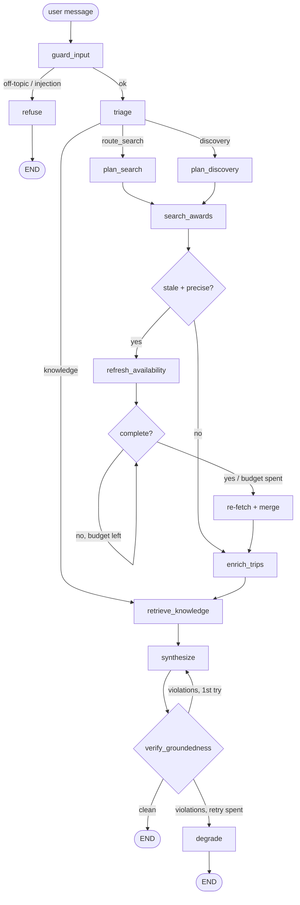

# Award Travel Agent — Design

**Date:** 2026-08-11
**Status:** Approved, not yet implemented

An agentic award-travel assistant built on LangGraph + LangChain, backed by the
seats.aero Partner API and a curated award-travel knowledge base.

---

## Problem

seats.aero answers *"is there award space on this route on this date?"* It does
not answer *"is that a good deal, which program should I book through, can my
points even get there, and is the seat any good?"*

That gap is the product. The API supplies data; a curated knowledge base supplies
judgment. The graph orchestrates the two.

Target questions:

- "All non-stop options to Asia from Chicago in business class"
- "From Chicago, where should I take a weekend trip during the summer?"
- "Can I transfer Chase points to Alaska?"

## Scope

A chat interface over a LangGraph agent with an intent router. Three branches:
precise route search, open-ended destination discovery, and knowledge Q&A.

**Out of scope:** revenue (cash) flights, booking execution, user accounts,
points-balance tracking.

---

## Architecture

### Graph



### Three decisions worth defending

**Retrieval happens after search, not before.** Retrieving on the raw user
question is strictly worse here — until results come back, we don't know the
query involves ANA and Aeroplan. Searching first lets the retrieval query be
built from what actually returned (programs, carriers, aircraft, destinations),
so the ANA 777 cabin review and the Aeroplan surcharge warning surface because
they are genuinely relevant. The `knowledge` branch skips straight to retrieval —
there is nothing to search.

**Two planners, not one.** `plan_search` is structured extraction: "non-stop to
Asia from Chicago in J" maps cleanly onto cached-search parameters.
`plan_discovery` is a different problem — no destination exists, so it enumerates
candidates from regional availability, narrows with seasonality knowledge, and
fans out a *budgeted* set of searches. One node doing both produces a prompt that
does neither well.

**Refresh is a node, not a tool.** Every other capability is exposed to the
model. Refresh is not: it costs daily quota and mutates shared state. The model
decides *what* to search; the graph decides *when* to spend money.

### State

```ts
messages       // conversation, messagesStateReducer
intent         // 'route_search' | 'discovery' | 'knowledge' | 'rejected'
searchPlan     // structured seats.aero parameters
awardResults   // normalized availability
kbDocs         // retrieved chunks with source ids
draft          // synthesized answer
violations     // groundedness failures
revisionCount  // retry budget
```

### Bounded loops

Both loops in the graph terminate by construction:

- **Refresh poll:** bounded by attempt count *and* wall clock. Falls through to
  stale-but-labeled data rather than hanging. Freshness is surfaced in the UI —
  "confirmed 40 seconds ago" is the single most valuable thing this app can tell
  an award traveler.
- **Groundedness retry:** one retry with violations fed back, then `degrade`
  emits a hedged answer. Unbounded self-correction is where agent demos hang.

### Budgets and thresholds

Starting values. These are the knobs to tune, not laws — but they are pinned so
implementation is not guessing.

| Knob | Value | Why |
|---|---|---|
| `plan_discovery` search budget | 6 tool calls max | Bounds a vague question against the 1,000/day quota |
| `enrich_trips` top-N | 5 results | Enough to name aircraft and verify nonstop on what gets recommended |
| Refresh gate | `intent === 'route_search'` **and** result count ≤ 10 **and** `UpdatedAt` older than 6h | Discovery fan-out must never queue refreshes |
| Refresh top-N | 5 availability IDs | Each newly queued ID costs one daily credit |
| Refresh poll | 6 attempts, 10s apart, 60s wall-clock ceiling | Docs say queued items typically settle within a minute |
| Groundedness retries | 1, then `degrade` | |
| seats.aero response cache TTL | 6h, matching the staleness threshold | Cache and refresh gate should not disagree |

---

## Tools

Five tools, each a LangChain `tool()` with a Zod schema.

| Tool | Endpoint | Role |
|---|---|---|
| `searchAwardAvailability` | `GET /partnerapi/search` | Precise queries — known airports and dates |
| `findRegionalAvailability` | `GET /partnerapi/availability` | Discovery — region→region, one program at a time |
| `getTripDetails` | `GET /partnerapi/trips/{id}` | Segments, aircraft, flight numbers for top-N |
| `resolveLocation` | local | "Chicago" → `[ORD, MDW]`, "Asia" → region |
| `listProgramRoutes` | `GET /partnerapi/routes` | Best-effort nonstop reachability; degrades silently |

`resolveLocation` is a deterministic lookup, not an LLM call. Asking a model to
emit IATA codes invites hallucinated airports; a table cannot hallucinate.

`listProgramRoutes` is not in the public docs (it works, and `aero-connections`
uses it). Treated as best-effort with graceful degradation — nothing load-bearing
depends on it.

### API constraints that shape the design

- **1,000 API calls/day** on a Pro key. This is why `plan_discovery` has an
  explicit search budget instead of fanning out freely.
- **Cached search requires origin and destination airports.** Region-scoped
  searches belong on bulk availability, which is what the docs recommend for
  expansive queries. The discovery branch is built on the documented behavior,
  not on the undocumented optional-parameter behavior.
- **Refresh** (`POST /partnerapi/refresh`) accepts 1–250 availability IDs, is
  asynchronous (poll until `complete`), costs one daily credit per *newly queued*
  item (already-fresh items are free), and is capped at 2,000 calls/hour.
  Commercial keys are blocked; Pro keys work.
- **Live Search** (`POST /partnerapi/live`) requires a commercial agreement and
  is unavailable to Pro users. Not implemented.

### Data layer

One interface, two implementations, selected by `SEATS_AERO_API_KEY` presence:

```
SeatsAeroClient
├── LiveSeatsAeroClient    → HTTP, rate-limit header tracking, 429 backoff
└── ReplaySeatsAeroClient  → recorded JSON, keyed by normalized request
```

`make record` runs a fixed query set against live and writes fixtures. Reviewers
without a key get real seats.aero response shapes, frozen. Evals always pin to
replay so they are reproducible. The graph never knows which is active.

---

## Knowledge base and RAG

Five collections in `knowledge/`, authored as markdown with YAML frontmatter.

| Collection | Contents | Powers |
|---|---|---|
| `sweet-spots/` | Per-program chart highlights — Turkish 45k J to Europe, ANA F via Virgin, Aeroplan distance bands, LifeMiles no-surcharge | "That price is bad, here's better" |
| `transfers/` | Card currency → program, ratios, typical bonuses, cpp baselines | "Your Chase points can't reach Alaska" |
| `booking/` | Fuel surcharges, phone-only bookings, stopovers, married segments, hold policies | "Here's how you actually book it" |
| `seasonality/` | When to go where, shoulder seasons, weekend-worthy by hub | The discovery branch |
| `products/` | Cabin product reviews by airline + aircraft + cabin | "88k on ANA's 777 Room, not Lufthansa's 2-2-2" |

Frontmatter carries the metadata that makes retrieval good:

```yaml
---
id: ana-777-business-the-room
collection: products
airlines: [NH]
aircraft: [777-300ER]
cabin: business
programs: [united, aeroplan, virginatlantic]
updated: 2026-06-01
sources: ["https://..."]
---
```

That metadata does two jobs. It enables **pre-filtered vector search** —
`retrieve_knowledge` filters to `airlines ∈ {carriers in results}` before
semantic ranking, which is why searching-before-retrieving pays off. And
`sources` + `updated` mean synthesis **cites** product opinions rather than
asserting them. Editorial opinion presented as fact is the sloppiest thing an
award-travel agent can do.

**Storage:** MongoDB Atlas Vector Search via `@langchain/mongodb`, Voyage
embeddings. Atlas Vector Search supports metadata pre-filtering natively, which
is precisely why it beats an in-memory store here — the filtering is not a
bolt-on.

**Chunking:** one document per concept, no splitting. A sweet spot or a cabin
review is 150–400 words and already atomic; recursive splitting would sever a
claim from its caveat and actively hurt retrieval quality.

---

## Guardrails

**Input guard.** Rejects off-topic and prompt-injection-shaped queries before
they reach the planner. Light PII scrub (points balances, confirmation numbers)
before anything is logged to LangSmith.

**Groundedness gate.** Every flight, price, date, and airline the answer claims
must trace to a tool result or a cited KB document. This is the failure mode that
matters in this domain: an LLM will cheerfully invent "Lufthansa First on Aug 14
for 87,000 miles" when the tool returned nothing.

---

## Models and cost

**`claude-sonnet-5` throughout**, via `@langchain/anthropic`.

Three model-specific facts the implementation must respect:

1. **`temperature: 0` returns a 400.** Sonnet 5 rejects non-default sampling
   parameters. `ChatAnthropic` is commonly instantiated with `temperature: 0`;
   that is a hard error here. Omit sampling params entirely — determinism comes
   from `effort: "low"` plus a tight prompt.
2. **Thinking is on by default.** Omitting `thinking` runs adaptive, and
   `max_tokens` caps thinking *plus* response text together. Every node thinks
   unless configured otherwise.
3. **Mid-conversation system messages are not available on Sonnet 5.** Dynamic
   context goes into user-turn content, not a `role: "system"` message.

### Effort tiering

The larger cost lever, and legitimate rather than wishful — Sonnet 5 respects
effort levels strictly.

| Node | Setting |
|---|---|
| `guard_input`, `triage` | `effort: "low"`, adaptive thinking |
| `plan_search`, `plan_discovery` | `effort: "low"` — extraction, not reasoning |
| `verify_groundedness` | `effort: "low"` — mostly deterministic checks |
| `synthesize` | `effort: "medium"`, tune up if answers read thin |

Prefer `adaptive + effort: "low"` over `thinking: {type: "disabled"}` on the cheap
nodes: disabled thinking makes Sonnet 5 noticeably less willing to reach for
tools, and low effort captures most of the saving without that side effect.

### Prompt caching

Cache minimum on Sonnet 5 is **1024 tokens**. Below that a `cache_control` marker
silently does nothing — no error, `cache_creation_input_tokens: 0`. Caching is
therefore applied to exactly four surfaces:

| Surface | Cached |
|---|---|
| `synthesize` system prompt (style, citation rules, groundedness contract) | Yes — long and frozen |
| `plan_search` system prompt (program list, region reference, few-shot) | Yes — long and frozen |
| Tool definitions (render at position 0, cached with system) | Yes, for free |
| Conversation prefix on follow-up turns (breakpoint on last block of last turn) | Yes — the multi-turn win |
| `guard_input` / `triage` prompts | **No** — under the minimum |
| Retrieved KB documents | **No** — vary per query by design |

**The trap this design avoids:** the planner needs today's date to resolve "this
summer." Interpolating it into a system prompt puts a daily-changing value at the
very front of the prefix and invalidates everything after it. Date goes in the
message. Same for the resolved search plan and quota state.

### Other cost controls

- **seats.aero response cache** — Mongo TTL collection keyed by normalized
  request. The dev loop re-runs the same queries constantly; without this the
  1,000/day quota is gone by lunch.
- **Evals pinned to fixtures** — no live API calls, no re-embedding.

### Cost visibility (development)

1. **Per-node usage callback** — a LangChain callback handler accumulating token
   usage per node, printing a per-turn breakdown to the terminal. Splits
   `cache_read_input_tokens` / `cache_creation_input_tokens` / uncached
   `input_tokens` separately: if cache reads sit at zero across identical
   prefixes, something is invalidating and that needs to be visible immediately.
2. **Cost HUD** in the dev UI — this turn's cost, session total, cache hit rate,
   seats.aero quota remaining (from `x-ratelimit-*`), refresh credits spent.
   Dev-only.
3. **Pricing constants in one file.** Sonnet 5 is $3/$15 per MTok, with
   introductory pricing of $2/$10 **through 2026-08-31**. The expiry goes in a
   comment so the calculator does not rot silently on Sept 1.

**Open item for Phase 3:** how `@langchain/anthropic` currently surfaces
`cache_control` (message-content blocks vs. a model-level option) must be
verified against the installed package rather than assumed. LangChain's Anthropic
passthrough has moved between releases.

---

## LangSmith

**Tracing.** LangChain and LangGraph auto-trace, but the default trace is
generic. Two additions make it readable:

- `@traceable` wrapping the seats.aero client, so every HTTP call — endpoint,
  latency, cursor page, quota remaining — appears as a child span. A discovery
  query costing 6 API calls and 3.2s is visible at a glance.
- Run metadata: `thread_id`, `intent`, resolved `searchPlan`, `mode: replay|live`,
  refresh credits spent. Tagging by mode matters — otherwise eval runs and demo
  runs pollute the same project.

**Evals — three datasets, deliberately layered.**

| Dataset | Size | Evaluator |
|---|---|---|
| `intent-routing` | ~24 | Exact match on expected intent. No LLM judge. Includes off-topic, injection-shaped, and genuinely ambiguous ("Tokyo") cases. Runs in seconds — re-run on every prompt tweak. |
| `search-planning` | ~16 | Custom evaluator, field-level partial credit: origin set F1, destination/region match, date-window IoU, cabins set, nonstop flag. Highest-leverage dataset — a bad plan poisons every downstream node, and evaluating it needs no generation. |
| `end-to-end-groundedness` | ~10 | Two evaluators against replay fixtures (below). |

The end-to-end pair:

- **Deterministic hallucination check** — extract every flight number, mileage
  figure, airline code, and date from the answer; assert each appears in the tool
  results. No LLM, no flake, no cost.
- **LLM-as-judge for helpfulness** — did it answer, cite KB sources, name a
  program, give a booking path. This genuinely needs judgment.

The layering is the point: use the cheapest evaluator that can catch each class
of error, and reserve LLM judges for what only judgment can score.

`search-planning` injects a **frozen clock** — "this summer" resolves relative to
today, and without pinning it the dataset silently rots and starts failing in
September.

---

## Interface

Next.js streaming chat over the headless graph.

- Token streaming from `synthesize`.
- Node-level status events surfaced in the UI ("Searching 4 programs ORD→Asia…"),
  so the graph's execution is visible during the walkthrough.
- Freshness labeling on every result: cached-as-of timestamp, or
  confirmed-N-seconds-ago after a refresh.

### AeroConnections integration

`aero-connections` keeps its entire search state in the URL via `nuqs`:
`origin`, `dest` (SelectionContext); `start`, `end`, `cabins`, `direct`,
`airlines`, `excludeAirlines`, `maxDist`, `transferPartners` (FilterContext);
`program` (RoutesContext); `flight` (FlightFocusContext).

So each recommended option carries a deep link with **zero changes** to that
project:

```
/?origin=ORD&dest=NRT&start=2026-08-14&end=2026-08-21&cabins=business&direct=true&program=aeroplan
```

`flight` pins a specific trip, so the link can open AeroConnections focused on the
exact recommended flight. The agent reasons; the map visualizes.

**iframe embedding was considered and rejected.** AeroConnections gates
availability behind seats.aero OAuth with a `SameSite=lax` session cookie. In a
cross-origin iframe that cookie is not sent, so the embed renders logged-out — a
Connect button that cannot complete OAuth inside a frame. It would be the most
fragile element of a live demo.

A native mini-map (maplibre + `@turf/great-circle`, the same libraries
`aero-connections` uses) rendering route arcs inline in chat is the stretch goal:
full styling control, no cross-origin auth risk.

---

## Project structure

```
award-travel-agent/
├─ docker-compose.yml          # mongodb/mongodb-atlas-local
├─ Makefile                    # setup, seed, dev, record, eval
├─ knowledge/                  # 5 markdown collections with frontmatter
├─ fixtures/seats-aero/        # recorded API responses
├─ src/
│  ├─ agent/
│  │  ├─ graph.ts              # LangGraph wiring — the whole flow in one file
│  │  ├─ state.ts              # Annotation.Root
│  │  ├─ nodes/                # one file per node
│  │  └─ prompts/
│  ├─ tools/
│  │  ├─ seats-aero/{types,live,replay,index}.ts
│  │  └─ {searchAwards,regionalAvailability,tripDetails,resolveLocation,programRoutes}.ts
│  ├─ rag/{store,ingest}.ts
│  ├─ cost/{pricing,callback}.ts
│  ├─ deeplink.ts              # AeroConnections URL builder
│  └─ app/                     # Next.js chat UI + streaming /api/chat
├─ evals/{datasets,evaluators,run.ts}
└─ docs/
```

Single Next.js app, not a monorepo. The graph lives in `src/agent/` and is
imported headless by `evals/run.ts` via `tsx`. A package split here would be
ceremony.

**Persistence:** MongoDB serves three roles — vector store
(`@langchain/mongodb`), LangGraph checkpointer
(`@langchain/langgraph-checkpoint-mongodb`, giving thread persistence and
resumable conversations), and the seats.aero response cache.

**Setup:** `make setup && make seed && make dev`. Docker brings up Atlas Local,
seed builds the vector index and embeds the KB, dev runs Next. With no
`SEATS_AERO_API_KEY` the app runs entirely on fixtures.

---

## Build phases

Each phase is independently demo-able.

| Phase | Delivers |
|---|---|
| 1 | seats.aero client (live + replay), tools with Zod schemas, `make record` |
| 2 | KB authored, Mongo vector store, ingest script |
| 3 | Graph: state, guard, triage, both planners, search, retrieve, synthesize. Verify LangChain `cache_control` surface. |
| 4 | Refresh loop, groundedness verify, degrade |
| 5 | Next.js streaming chat, node status events, cost HUD, AeroConnections deep links |
| 6 | LangSmith tracing polish, three eval datasets, README with Mermaid diagram |
| 7 | *Stretch:* native mini-map, Tavily web search in the discovery branch |

---

## Deferred

- **Tavily web search** in the discovery branch ("what's Lisbon like in July").
  Real value, but the easiest place for this project to sprawl into a generic
  research agent and lose its identity. Add only if discovery answers feel thin
  without it.
- **Live Search** (`POST /partnerapi/live`) — requires a commercial agreement.
- **Native mini-map** — stretch; deep links ship first.

## Environment

```
ANTHROPIC_API_KEY        # required
VOYAGE_API_KEY           # required — embeddings
MONGODB_URI              # required — Atlas Local via docker compose
LANGSMITH_API_KEY        # required — tracing and evals
LANGSMITH_PROJECT
SEATS_AERO_API_KEY       # optional — absent means replay mode
```
